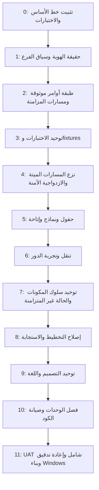

# برنامج المعالجة التنفيذي الرئيسي

**النطاق:** هذا البرنامج يحوّل نتائج تدقيق المنتج المستقل السابق والمحتوى المرفق إلى أعمال إصلاح قابلة للتتبع. لا يغيّر سياسة الأدوار أو الفروع أو الترخيص أو القواعد المحاسبية دون قرار صريح.  
**قاعدة الإغلاق:** لا تُغلق أي نتيجة إلا بعد معالجة السبب الجذري، اختبار انحدار أو harness مناسب، تحقق وقت التشغيل عند صلته بالواجهة، وتوثيق ما أُبقي للتوافق.  
**مرجع النتائج:** `audit-output/as-built-independent-audit/provisional-issue-register.md` وملفات الأدلة التابعة له.

## 1. رسم الاعتماديات التنفيذي

| المرحلة | الغاية | الاعتماديات | حالة البدء |
|---|---|---|---|
| 0 | تجميد baseline وإضافة حواجز الانحدار | لا شيء | مكتملة من التدقيق؛ يلزم تحديثها مع كل تغيير |
| 1 | إصلاح تناقضات حقيقة المصادقة وسياق الفرع | 0 | **P0 — يبدأ أولاً** |
| 2 | توحيد كتابة العمليات/المزامنة وراء نتائج صريحة | 1 | لا يبدأ قبل إغلاق P0 |
| 3 | تصحيح fixtures والاختبارات المتقادمة وفصل native-blocked | 1–2 | يبدأ بالتوازي الجزئي بعد P0 |
| 4 | إزالة/عزل المسارات غير القابلة للوصول والنسخ المكررة | 3 | يتطلب إثبات callers وIPC وmigration |
| 5 | توحيد منطق الحقول والتحقق والإتاحة | 2–4 | لا يغيّر قواعد الأعمال |
| 6 | تنقل متماسك وتجارب أدوار واضحة | 4–5 | يحافظ على صلاحيات السياسة الحالية |
| 7 | حالات async، منع double-submit، مكونات الحوارات | 5–6 | يعتمد على أوامر ونتائج صريحة |
| 8 | تخطيط RTL والاستجابة والجداول والنوافذ | 5–7 | يختبر عند المقاسات المحددة |
| 9 | design system والمصطلحات | 6–8 | لا يعيد تصميم العلامة التجارية بلا حاجة |
| 10 | تفكيك آمن للملفات الكبيرة والـglobals | 1–9 | بعد تثبيت العقود والاختبارات |
| 11 | UAT، إعادة تدقيق، build وفحص الحزمة | كل ما سبق | قرار قبول نهائي مبني على دليل |

## 2. سجل الإغلاق التفصيلي للنتائج الحالية

| ID | التصنيف / الشدة | الصفحة أو الميزة | السبب الجذري والحالة الحالية | القرار | الاعتماديات | الإصلاح المستهدف | الاختبار وUAT | rollback / معيار الإغلاق |
|---|---|---|---|---|---|---|---|---|
| R-001 | Product logic — **P0** | Login / `AuthCredentialTruth` | `ensureAuthCredentialsReady()` يهمل `{ok:false}` ونتيجة timeout ثم يعيد `{ok:true}`؛ المستدعون لا يفرعون على نتيجة جاهزية صريحة | **KEEP + FIX** | لا شيء | نتيجة readiness typed تفشل بصدق؛ لا login ولا seed ولا hydrate-followup عند failure | اختبار rejected/explicit failure/timeout + UI login failure state | rollback هو العقد السابق خلف feature-free adapter؛ الإغلاق عند منع الانتقال واختبار UI |
| R-002 | Data scope — **P0** | Metadata / branch writes | `RecordMetadata.getBranchId()` يختار `BR-MAIN` عند غياب سياق موثوق، فيمرر سجل غير scoped | **KEEP + FIX** | R-001 لا يلزم تقنياً | fail-closed لجميع writes؛ migration-only طريق منفصل ومُدقق | اختبار stamp/create/update بلا branch؛ smoke write/branch | الإغلاق عند عدم قبول أي write غير scoped وعدم كسر migration المصرح |
| R-003 | Test/release health — **P1** | Test runner/native SQLite | `npm test` أحمر؛ 20 SIGSEGV وassertions متقادمة مختلطة مع السلوك | **MERGE + FIX** | R-001/R-002 | تصنيف native blocked، تحديث assertions غير الآمنة فقط، منع fake-green | Runner unit + grouped logs + targeted suites | الإغلاق عند فصل blocked من failed دون اعتبار SIGSEGV pass |
| R-004 | Sync verification — **P1** | Cloud V2 | fixture يعلن `databaseVersion` بلا كل ملفات الجداول؛ سيناريو settings يخلق conflict غير معزول | **KEEP + FIX TEST** | R-002 | fixture builder كامل؛ سيناريو success منفصل عن conflict | `verify-cloud-v2` اخضر وينهي نفسه | rollback: fixtures القديمة تحفظ في evidence فقط؛ الإغلاق عند deterministic pass |
| R-005 | Quality gate — **P1** | ESLint | config يتجاهل renderer/cloud/electron والـlint الأحمر لا يمثل جودة الإنتاج | **REDESIGN GATE** | لا شيء | overrides للـrenderer/main/preload/browser، استبعاد artifacts فقط | lint source groups + config self-test | الإغلاق عند تغطية مسارات الإنتاج وعدم إدخال تقارير audit كـsource |
| R-006 | Legacy path — **P2** | `page-search` | صفحة موجودة لكن hidden و`showPage('search')` يحولها إلى clients | **REMOVE after proof** | R-003/R-005 | إزالة route/container/handlers/CSS بعد إثبات replacement في clients/invoices | static route/control test + UI redirect test | rollback commit منفصل؛ الإغلاق عند عدم وجود caller أو ID/handler يتيم |
| R-007 | Maintainability — **P1** | Renderer shell | `index.html` ضخم مع handlers/styles/globals/DOM coupling | **SPLIT incrementally** | R-001–R-006 | feature modules، shared validators/actions، shell رفيع | contract tests لكل extraction + smoke | لا full rewrite؛ الإغلاق المرحلي لكل feature وليس ادعاء إغلاق كامل مبكر |
| R-008 | Accessibility — **P1** | Forms/actions/dialogs | labels بلا `for` وcontrols بلا association وclickable divs | **REDESIGN primitives** | R-005 | Field/ActionButton/Dialog/Table primitives ثم الترحيل صفحةً صفحة | static a11y + keyboard/runtime checklist | الإغلاق لكل صفحة عند labels/roles/focus وحالات error/loading |
| R-009 | Information architecture — **P1** | Daily/Settings/Dashboard | مسؤوليات كثيرة مختلطة في الصفحة الواحدة | **KEEP + IMPROVE**؛ أي تغيير قواعد workflow = PRODUCT DECISION REQUIRED | R-001–R-008 | progressive disclosure، groups، advanced admin separation دون تعديل السياسة | page UAT role matrix + visual checks | الإغلاق على مستوى flow وليس نقل عناصر تجميلي فقط |
| R-010 | Responsive UX — **P2** | 10 pages with overflow signals | grids/widths/inline styles وتراكم المكونات؛ بعض clipping كان below-fold طبيعي | **FIX verified blockers** | R-008/R-009 | shared responsive rules، scroll/table/modal contracts | 5 viewports × 3 scaling + screenshot/DOM evidence | الإغلاق فقط للـhorizontal overflow/overlap الحقيقيين، لا falsify vertical scroll |
| R-011 | Dependency hygiene — **P1** | Spreadsheet/export dependency path | `xlsx` advisory direct وtransitive advisories | **PRODUCT/TECH DECISION REQUIRED** إذا كان replacement يغير capability أو ترخيص | لا شيء | inventory usages، upgrade path أو isolated replacement | package/audit + import/export regression | لا upgrade قسري بدون توافق/قبول |
| R-012 | Terminology / technical exposure — **P2** | Settings/BootFlow/Sync UI | مفاهيم implementation مثل Cloud V2/Drive/sync تظهر في مسارات المستخدم | **KEEP + RENAME** ما لم تتغير دلالة product | R-009 | user-facing copy mapping، advanced diagnostics تبقى خلف admin/support | copy inventory + runtime screenshots | الإغلاق عند تطابق النص مع الفعل وعدم إخفاء معلومة تشغيلية لازمة |
| R-013 | Async/UI race review — **P1** | Search, save, modal, OAuth/setup, branch switching | 121 timers وglobal handlers؛ لا دليل بعد على كل race لكن السطح واسع | **AUDIT then FIX** | R-001/R-002/R-007 | generation IDs/busy guards/cancellation في التدفقات المؤكدة فقط | double-click/save, close/reopen, stale-result harnesses | لا speculative rewrite؛ الإغلاق لكل race مثبت |
| R-014 | CSS/design debt — **P2** | Shared renderer UI | inline styles، selectors مكررة، `!important`، cards/tables/forms غير موحدة | **MERGE + REDESIGN SYSTEM** | R-008–R-010 | tokens/primitives/classes مع إزالة تدريجية | visual regression والمقاسات المطلوبة | الإغلاق بإنقاص measurable duplicate patterns لكل migrated page |
| R-015 | Unclassified legacy authority | Legacy/localStorage/compat modules | 49 ملفاً يحتاج reconciliation و334 legacy markers | **CLASSIFY: KEEP / COMPATIBILITY_ONLY / MIGRATION_ONLY / DELETE** | R-002–R-005 | owner لكل authority وretention date/test | reachability + IPC + migration + UI caller proof | لا حذف قبل four-proof rule |

## 3. قواعد القرار والسياسة

| الحالة | التنفيذ المسموح | ما يحتاج قراراً من المنتج |
|---|---|---|
| bug أو fallback غير آمن أو test fixture متناقض | يُصلح مباشرة مع regression | لا شيء |
| label مضلل أو technical terminology بلا تغيير معنى | يُصحح مباشرة | لا شيء |
| تجميع تنقل أو إخفاء advanced controls مع بقاء capability | يُنفذ بعد role-UAT | إذا حُجبت capability مطلوبة لدور قائم |
| تغيير قواعد أسعار/ضرائب/عمولات/حجز/توافر | لا يُنفذ | **PRODUCT DECISION REQUIRED** |
| تغيير permissions أو Owner/Admin/branch/license policy | لا يُنفذ | **PRODUCT DECISION REQUIRED** |
| استبدال dependency أو تغيير format/import/export | يُحلل ويُختبر فقط | قرار عند تغير capability/ترخيص/compatibility |

## 4. مصفوفة الصفحات وقرار المسؤولية الأولي

| الصفحة | قرار مبدئي | الغرض القانوني بعد المعالجة | ما يُنقل/يُزال فقط بعد الاختبار |
|---|---|---|---|
| Dashboard | KEEP + IMPROVE | نظرة اليوم واختصارات الدور | أدوات queue والاختصارات حسب feature/role |
| Daily | KEEP + IMPROVE | encounter/registration flow | يُفصل داخل أقسام progressive disclosure لا تغيير مالية |
| Bookings | KEEP + IMPROVE | إنشاء وإدارة الحجوزات | حوكمة state/actions والـdate UX |
| Clients + Invoices | KEEP + MERGE SURFACES | بحث العميل/تاريخه/فواتيره | retired `page-search` بعد proof |
| Settings | SPLIT INTERNALLY | administration workspaces | feature flags/advanced support تفصل بصرياً لا سياسة |
| Reports | KEEP + IMPROVE | query-driven reports | labels/loading/no-data distinction |
| Workforce/Inventory/Finance | KEEP | contexts مستقلة | لا تغيير business calculations دون approval |
| Owner Hub / Licensing | KEEP + ISOLATE | owner/support-only operations | لا يظهر كمسار يومي للعاديين |
| Queue display | KEEP | شاشة خارجية مستقلة | لا تخلط مع dashboard إلا shortcut feature-gated |

## 5. تعريف الإنجاز التنفيذي

لكل change set، يجب تسجيل: ملفات الإنتاج، ملفات الاختبار، IDs المغلقة، screenshot/runtime evidence حيث ينطبق، ونتيجة lint/test/build. لا يعني انتهاء مرحلة إغلاق كل debts المستقبلية؛ يعني فقط أن العقد المرتبط بها صالح وغير متناقض. كل نتيجة لم تُغلق تُنقل صراحة إلى BLOCKED أو PRODUCT DECISION REQUIRED مع السبب.
